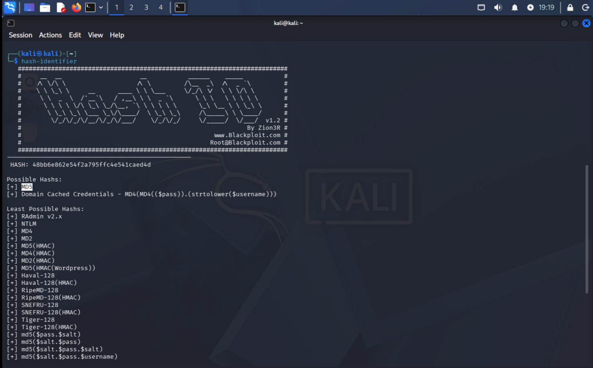
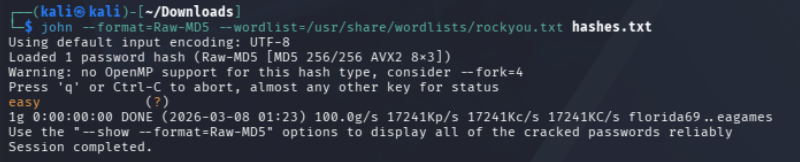
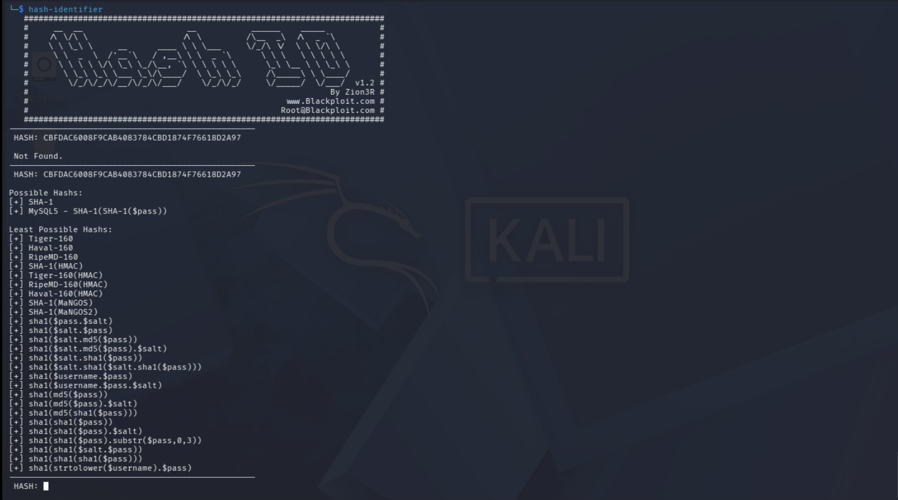
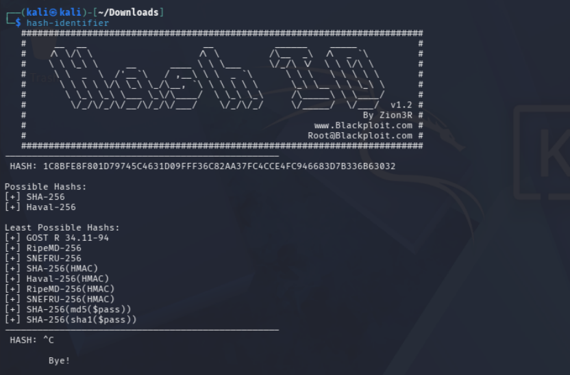
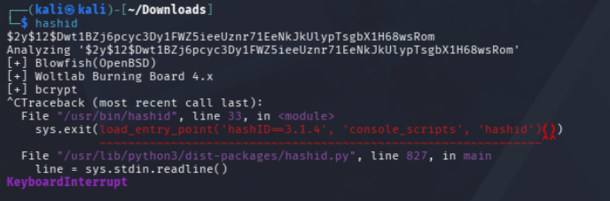
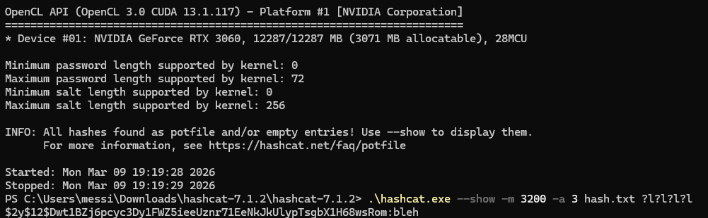
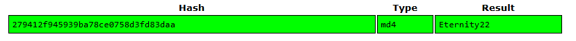

# Crack the Hash 🔒
This challenge goes over basic level hash cracking. There are two levels, each with a couple of hashes that we need to crack. The first level contains some hashes without any salts while the second level 
ups the difficulty by adding salts to the hashes. 

## Quick Note
Because I've already worked on the challenge I made sure to delete the contents of John the Ripper's pot file to clear all of the cracked passwords from this challenge. For some of the questions, the files I save the hash will be different. 

# Level 1 
These are the questions and answers to the Level 1 questions:

### Question 1
The hash we have to crack is:
```text
48bb6e862e54f2a795ffc4e541caed4d
```

We can use tools like `hashid` or `hash-identifier` to identify the type of hash. For this example, I used the latter:


- The results indicate that the hash is most likely either an **MD5** hash or a **Windows Domain Cached Credentials** hash

We can save this hash to a file, in my case I saved it to a file called ``hashes.txt``, and use **John the Ripper** to crack it:

```Bash
john --format=Raw-MD5 --wordlist=/usr/share/wordlists/rockyou.txt hashes.txt

```

- ``--format=Raw-MD5`` specifies the format that **John** will use to crack the hash. This option is not required since John can detect the hash type in most cases.
- ``--wordlist=/usr/share/wordlists/rockyou.txt`` specifies the wordlist **John** will use to compute the candidate hashes and compare them to the target hash to find a match.
- ``hashes.txt`` contains our hash.

The cracked hash evaluates to:



### Question 2
The next hash we have to crack is:
```text
CBFDAC6008F9CAB4083784CBD1874F76618D2A97
```

We can again use ``hash-identifier`` to determine the type of hash:

- The results indicate that this hash is most likely a **SHA-1** hash or a **MySQL SHA-1** hash

We can save this hash to ``hash.txt`` and use **John the Ripper** to crack it:

 ```Bash
john --format=Raw-SHA1 --wordlist=/usr/share/wordlists/rockyou.txt hash.txt
```

The cracked hash evaluates to:


### Question 3
The next hash we have to crack is:
```text
1C8BFE8F801D79745C4631D09FFF36C82AA37FC4CCE4FC946683D7B336B63032
```

Using ``hash-identifier`` the hash is most likely a **SHA-256** hash:


Using this hash format with **John the Ripper**, the cracked hash evaluates to **letmein**:


### Question 4
The next hash we have to crack is:
```text
$2y$12$Dwt1BZj6pcyc3Dy1FWZ5ieeUznr71EeNkJkUlypTsgbX1H68wsRom
```

Using ``hashid`` I found that this format is likely a **Blowfish (BSD)** hash:



These hashes are difficult to crack because they take a long time to crack. **John the Ripper** is **CPU-based** so it's optimized for cracking passwords on computers without powerful GPUs. Luckily my personal computer has a decently powerful GPU, so I used **hashcat** for this question:

The syntax is explained as follows:
- ``--show`` tells **hashcat** to show the value of the cracked password
- ``-m 3200`` indicates the mode **hashcat** is using. Similar to the ``--format`` option for **John the Ripper**, it specifies what type of hash to crack. All of the hashes that are supported by **hashcat** are listed on [here](https://hashcat.net/wiki/doku.php?id=example_hashes).
- ``-a 3`` indicates the attack mode **hashcat** is going to use. This attack mode is called a **mask attack** in which we can specify a password pattern that **hashcat** will use to crack the password.
- ``?l?l?l?l`` is the mask that we specified. This mask covers all combinations of 4 lowercase character words.

The hash evaluates to the word **bleh**:


### Question 5
The final hash is:
```
279412f945939ba78ce0758d3fd83daa
```

I had no luck with trying to crack this password on my virtual machine and my personal computer due to a technical issue so instead I used a website called [crackstation.com](https://crackstation.net/) to do the job for me:



- **Crackstation** makes it easy to crack hashes since it checks the hash against a large database of previously cracked hashes and common passwords, allowing us to quickly recover the plaintext without needing to perform our own brute-force attack.

# Level 2
These are the questions and answers for Level 2


### Question 1
