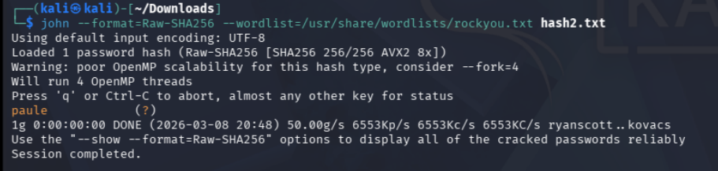
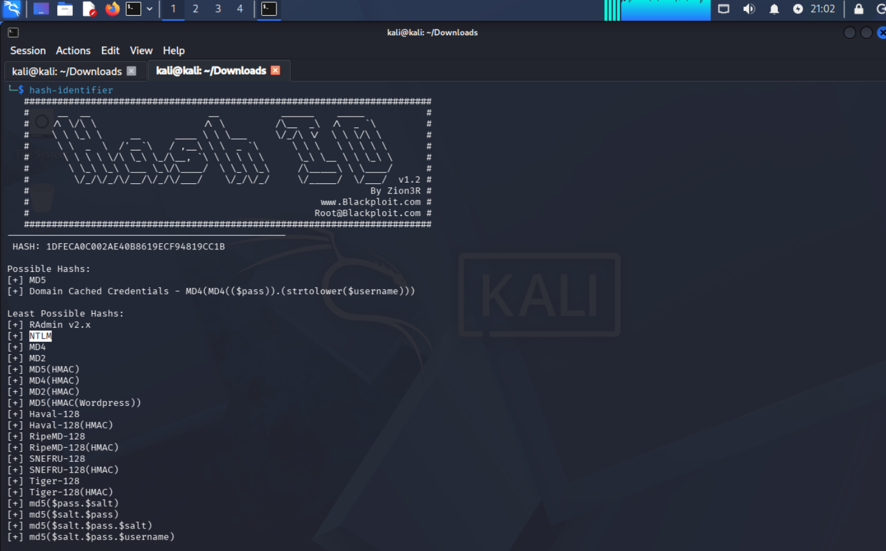
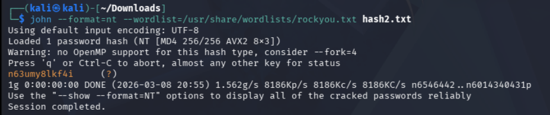
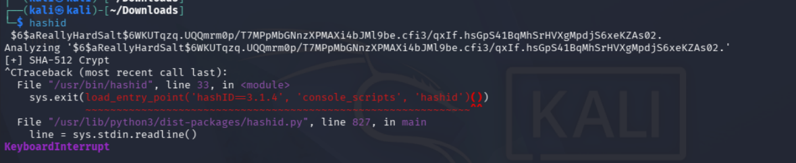
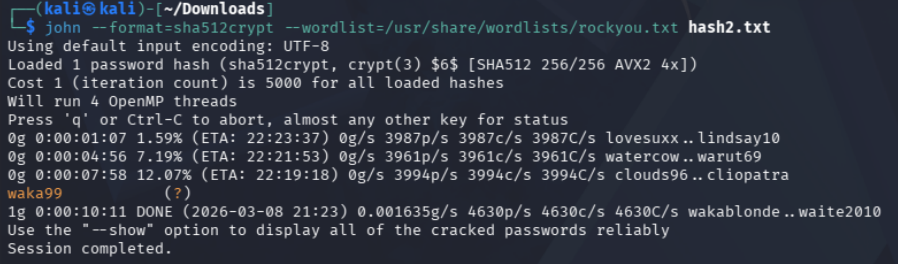
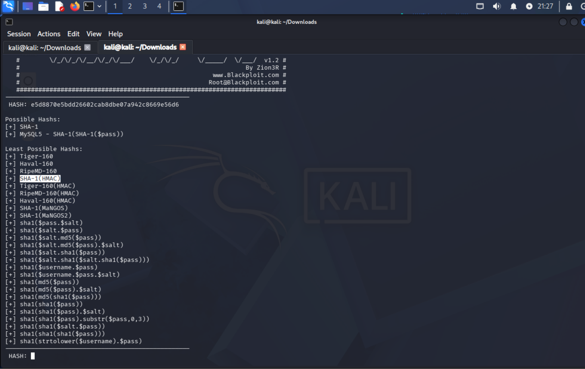
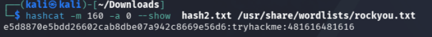

# Crack the Hash 🔒
This challenge covers the basics of hash cracking and is divided into two levels, each containing several hashes that must be cracked. The first level consists of hashes without salts, making them easier to crack, while the second level increases the difficulty by introducing salted hashes.

## Quick Note
Since I had already worked on this challenge before, I deleted the contents of **John the Ripper’s** pot file to remove any previously cracked passwords related to this challenge. Additionally, for some of the questions, I saved the hashes in different files.

# Level 1 
Below are the questions and answers for the **Level 1** section of the challenge.

### Question 1
The hash we have to crack is:
```text
48bb6e862e54f2a795ffc4e541caed4d
```

We can use tools like `hashid` or `hash-identifier` to identify the type of hash. For this example, I used the latter:


- The results indicate that the hash is most likely either an **MD5** hash or a **Windows Domain Cached Credentials** hash

We can save this hash to a file, in my case ``hashes.txt``, and use **John the Ripper** to crack it:

```Bash
john --format=Raw-MD5 --wordlist=/usr/share/wordlists/rockyou.txt hashes.txt

```

- ``--format=Raw-MD5`` specifies the format that **John** will use to crack the hash. This option is not required since John can detect the hash type in most cases.
- ``--wordlist=/usr/share/wordlists/rockyou.txt`` specifies the wordlist **John** will use to compute the candidate hashes and compare them to the target hash to find a match.
- ``hashes.txt`` contains our hash.

The cracked hash evaluates to:


### Question 2
The next hash we have to crack is:
```text
CBFDAC6008F9CAB4083784CBD1874F76618D2A97
```

We can again use ``hash-identifier`` to determine the type of hash:

- The results indicate that this hash is most likely a **SHA-1** hash or a **MySQL SHA-1** hash

We can save this hash to ``hash.txt`` and use **John the Ripper** to crack it:

 ```Bash
john --format=Raw-SHA1 --wordlist=/usr/share/wordlists/rockyou.txt hash.txt
```

The cracked hash evaluates to:


### Question 3
The next hash we have to crack is:
```text
1C8BFE8F801D79745C4631D09FFF36C82AA37FC4CCE4FC946683D7B336B63032
```

Using ``hash-identifier`` the hash is most likely a **SHA-256** hash:


Using this hash format with **John the Ripper**, the cracked hash evaluates to **letmein**:


### Question 4
The next hash we have to crack is:
```text
$2y$12$Dwt1BZj6pcyc3Dy1FWZ5ieeUznr71EeNkJkUlypTsgbX1H68wsRom
```

Using ``hashid`` I found that this format is likely a **Blowfish (BSD)** hash:


These hashes are difficult to crack because they take a long time to crack. **John the Ripper** is **CPU-based** so it's optimized for cracking passwords on computers without powerful GPUs. Luckily my personal computer has a decently powerful GPU, so I used **hashcat** for this question:

The syntax is explained as follows:
- ``--show`` tells **hashcat** to show the value of the cracked password
- ``-m 3200`` indicates the mode **hashcat** is using. Similar to the ``--format`` option for **John the Ripper**, it specifies what type of hash to crack. All of the hashes that are supported by **hashcat** are listed on [here](https://hashcat.net/wiki/doku.php?id=example_hashes).
- ``-a 3`` indicates the attack mode **hashcat** is going to use. This attack mode is called a **mask attack** in which we can specify a password pattern that **hashcat** will use to crack the password.
- ``?l?l?l?l`` is the mask that we specified. This mask covers all combinations of 4 lowercase character words.

The hash evaluates to the word **bleh**:


### Question 5
The final hash is:
```
279412f945939ba78ce0758d3fd83daa
```

I was unable to crack this hash on both my virtual machine and personal computer due to a technical issue. Instead, I used the website [crackstation.com](https://crackstation.net/) to recover the plaintext:


- **Crackstation** makes it easy to crack hashes since it checks the hash against a large database of previously cracked hashes and common passwords, allowing us to quickly recover the plaintext without needing to perform our own brute-force attack.

# Level 2
These are the questions and answers for Level 2:


### Question 1
The hash we have to crack is:
```text
F09EDCB1FCEFC6DFB23DC3505A882655FF77375ED8AA2D1C13F640FCCC2D0C85
```

Using `hash-identifier` I identified that this hash was either a **SHA-256** or a **Haval-256** hash:
.png)


Using the **SHA-256** format with **John the Ripper** the hash evaluates to `paule`:



### Question 2
The next hash we have to crack is:
```text
1DFECA0C002AE40B8619ECF94819CC1B
```

Using `hash-identifier` I identified that this hash can either be a **MD5** hash or a **Domain Cached Credential** hash. Since this hash pattern is similar to several other formats, I tested a few possibilities and, through trial and error, confirmed that the hash was actually an **NTLM** hash.


Using this format with **John the Ripper**, the hash evaluates to `n63umy8lkf4i`:



### Question 3
The next we have to crack is:
```text
Hash: $6$aReallyHardSalt$6WKUTqzq.UQQmrm0p/T7MPpMbGNnzXPMAXi4bJMl9be.cfi3/qxIf.hsGpS41BqMhSrHVXgMpdjS6xeKZAs02.
Salt: aReallyHardSalt
```

Using `hashid` I identified that this hash is a **SHA-512 Crypt** hash:


- Tools like `hashid` and `hash-identifier` attempt to determine the hash type based on its format and structure. Some salted hashes can still be identified if the algorithm has a recognizable pattern.
- The `$6` at the beginning of the hash gives away the identity of the hash (**SHA-512**).


Using this format, this hash evaluates to **waka99**:


### Question 4
The final hash we have to crack is:
```text
Hash: e5d8870e5bdd26602cab8dbe07a942c8669e56d6
Salt: tryhackme
```

Like **Question 2**, using `hash-identifier` to identify the hash format didn't prove much so again after some trial and error I found that this hash was a **SHA-1(HMAC)** hash. Using **hashcat**, the hash evaluated to `481616481616`:




# Lessons Learned 📚

- **Hash identification is an important first step.** Tools like `hashid` and `hash-identifier` help narrow down the possible algorithms by analyzing the format and structure of the hash. However, these tools only provide *likely matches*, so testing multiple formats may still be necessary.

- **Different hashing algorithms require different cracking strategies.** Simpler hashes such as **MD5**, **SHA-1**, and **SHA-256** can often be cracked quickly using common wordlists like `rockyou.txt`, while stronger algorithms like **bcrypt (Blowfish)** are intentionally designed to slow down brute-force attacks.

- **Salted hashes increase the difficulty of cracking passwords.** By adding a unique value (the salt) to each password before hashing, precomputed attacks such as rainbow tables become ineffective, requiring attackers to compute hashes for each guess individually.

- **John the Ripper and Hashcat serve similar purposes but are optimized differently.**  
  - **John the Ripper** is typically optimized for CPU-based password cracking and works well for quick tests and automated hash detection.  
  - **Hashcat** is optimized for GPU acceleration and is generally much faster for large cracking tasks or computationally expensive hashes.

- **Online databases can sometimes crack hashes instantly.** Services like **Crackstation** compare hashes against large databases of previously cracked passwords. This demonstrates how dangerous it is to use weak or commonly used passwords.

- **Understanding hash formats helps speed up the cracking process.** Recognizable prefixes such as `$6$` for **SHA-512 Crypt** can reveal the algorithm immediately without relying entirely on identification tools.

---

# Tools Used 🛠️

- **John the Ripper**  
  A popular password cracking tool used for dictionary attacks, brute-force attacks, and automated hash detection.

- **Hashcat**  
  A high-performance password cracking tool that supports GPU acceleration and many advanced attack modes.

- **hashid**  
  A tool used to identify the possible type of a hash based on its structure.

- **hash-identifier**  
  Another hash identification tool that compares hashes against known patterns to suggest possible algorithms.

- **Crackstation**  
  An online hash cracking service that checks hashes against a large database of previously cracked passwords.

- **rockyou.txt**  
  A widely used password wordlist containing millions of common passwords, commonly used for dictionary attacks.

